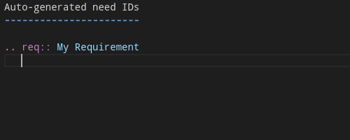
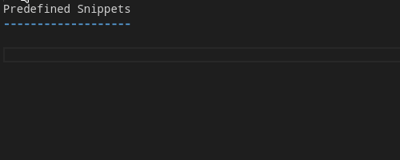
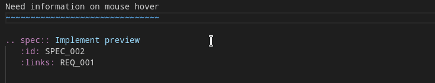
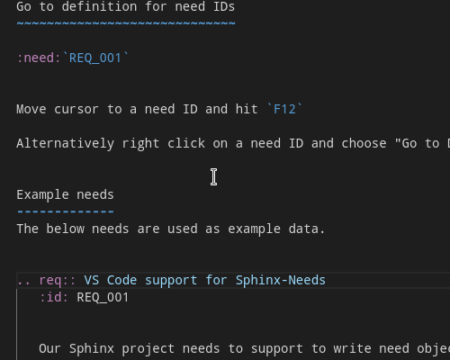

# Open-Needs IDE

VS Code extension, which supports developers by using 
[Sphinx-Needs](https://sphinxcontrib-needs.readthedocs.io/) or 
[Open-Needs](https://open-needs.org/).

The complete documentation can be found at:
https://open-needs.org/open-needs-ide/

## Features

### Auto-generated IDs

### Snippets

### ID selection

### Need preview

### Goto definition

